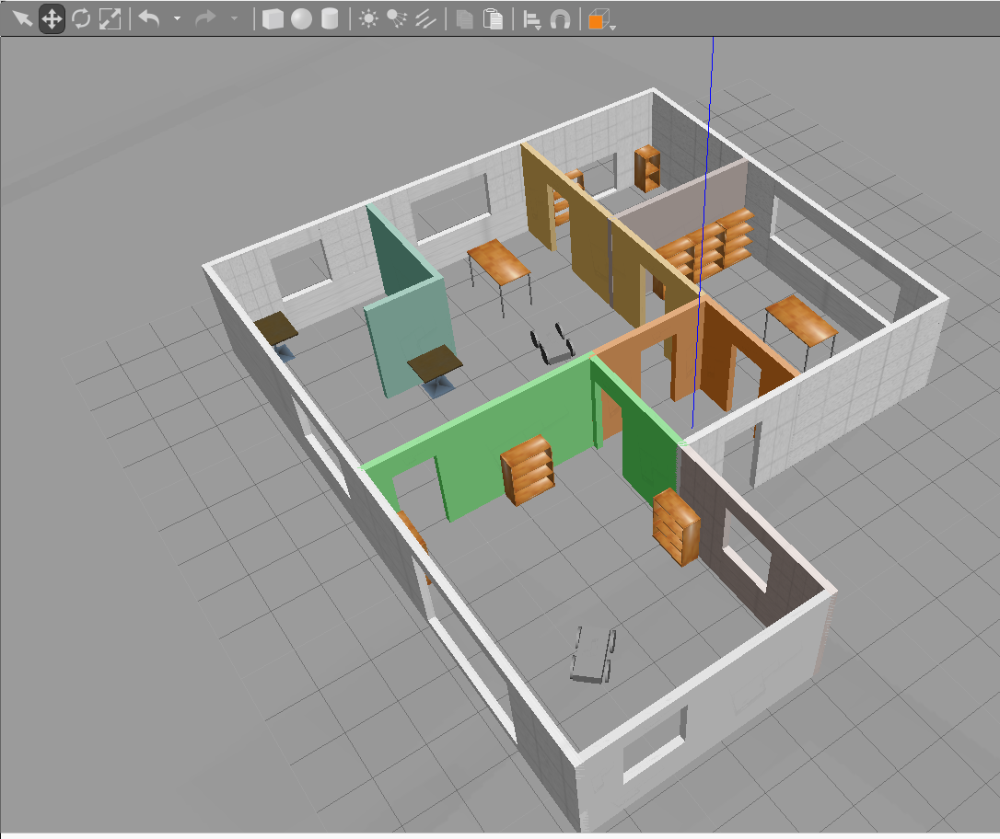
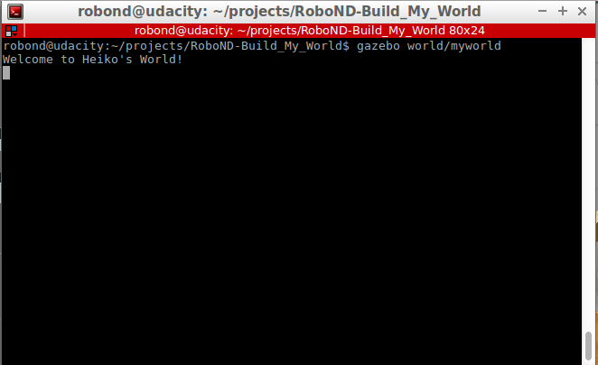

# Robotics Software Engineer Nanodegree - Project "Build My World"

This is the first project for the Udacity Robotics Software Engineer Nanodegree.
With Gazebo simulator, a world has been designed including online models, a
self designed simple robot model and an appartment like model as surrounding
environment:

As a bonus, a very simple plugin has been implemented that loads when Gazebo is
opening the world:

You can find the Project Rubric [here](https://review.udacity.com/#!/rubrics/2346/view)
here if you are enrolled in the program.

## Rubric Points
### The file system contains all required folders and files
If you clone the repository and build the plugin with CMake, you can reproduce
and test the implementation.

### The world includes a house with walls
A simple appartment model has been created and inserted into the world.

### The project includes an object created with the Gazebo Model Builder
The project includes a simple four wheel robot created with the Model Builder.
It consists of a base plate and four wheels with joints to the plate.

### The project contains a world with multiple objects
The Gazebo world is located in the project an contains the appartment, two
instances of the four wheel robot and additional models from the Gazebo online
model library.

### The project contains a C++ world plugin.
The world links to a welcome_message plugin that can be compiled using CMake.
After adding the location of libwelcomemessage.so to the GAZEBO_PLUGIN_PATH
environment variable, a welcome message is shown upon world loading with Gazebo.
